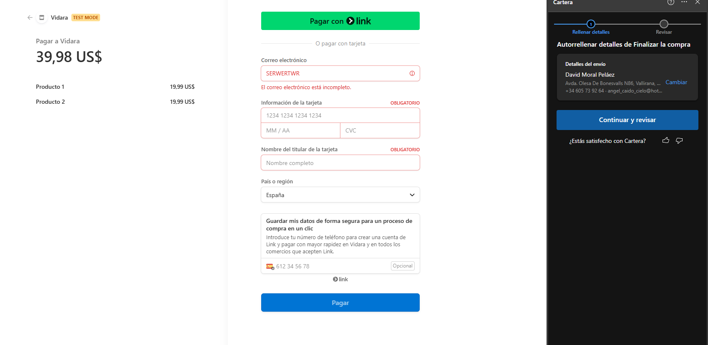

# Pasarela de Pago con Stripe

> **Proyecto de aprendizaje (2023).** Primera integración con una pasarela de pagos real. Parte de mi recorrido autodidacta: aprender haciendo cosas pequeñas que funcionan.

Tienda en línea básica que integra la API de Stripe en modo test. Dos productos hardcoded, carrito simple, redirección a Stripe Checkout para completar el pago.



## Stack

- **Backend:** Node.js + Express
- **Pagos:** Stripe API (modo test)
- **Frontend:** HTML + JavaScript vanilla
- **Otros:** body-parser, CORS

## Funcionalidades

- Catálogo con dos productos (imagen, precio, botón añadir al carrito)
- Carrito persistente en memoria del cliente
- Sesión de pago vía Stripe Checkout
- Redirección automática al gateway de Stripe

## Cómo ejecutar

Requisitos: Node.js instalado y una cuenta de Stripe (las claves de test sirven).

```bash
git clone https://github.com/Deivincci/pasarela_pago_stripe.git
cd pasarela_pago_stripe
npm install express stripe body-parser cors
```

Edita `server.js` y sustituye `stripeSecretKey` y `stripePublicKey` por tus claves de Stripe (Dashboard → Developers → API keys).

```bash
node server.js
```

Abre `http://localhost:3000` en el navegador.

## Notas

- Configurado para **modo test**: no se procesan transacciones reales.
- Para producción haría falta: claves live de Stripe, HTTPS, validación server-side de precios, persistencia en BD, manejo de webhooks.

## Contexto

Este repo forma parte de mi camino aprendiendo desarrollo: empecé con integraciones básicas como esta y fui sumando complejidad con el tiempo. Lo conservo archivado como referencia histórica del recorrido.

Trabajo más reciente en mi [perfil de GitHub](https://github.com/Deivincci).

## Licencia

[Apache License 2.0](LICENSE) — Copyright 2023 Deivincci
